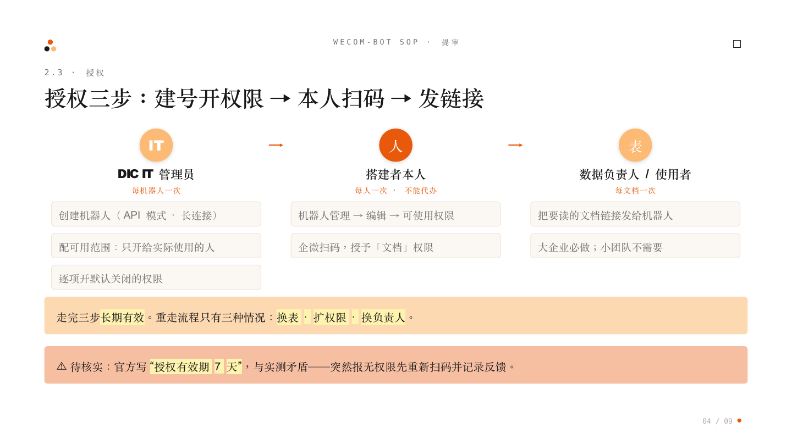
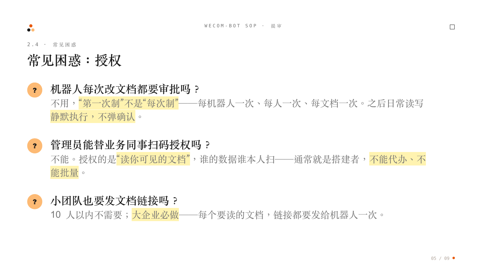

# 02 授权三步：建号开权限 → 搭建者本人扫码 → 发文档链接

**结论**：机器人发布通过后，授权总共就**三步**——**管理员建机器人开权限 → 搭建者（builder）本人扫码授权 → 大企业把文档链接发给机器人一次**。三步走完长期有效，日常使用不再审批。

## 三步操作指引

| 步骤 | 谁做 | 在哪做 | 做什么 | 频率 |
| :--- | :--- | :--- | :--- | :--- |
| **第一步：建机器人、开权限** | DIC IT（企微超级管理员） | 企业微信后台：工作台 → 智能机器人 → 手动创建 → API 模式 → 长连接 | 创建机器人；配置哪些群和同事能用；逐项开启默认关闭的权限（注意："能读文档"和"能查通讯录"是**两个独立开关**，用到哪项开哪项） | 每个机器人一次 |
| **第二步：扫码授权** | **搭建者本人（builder）**——就是用这台机器人的业务同事，**不是管理员** | 机器人管理 → 编辑 → 可使用权限 → 去授权（企微扫码） | 把「文档」权限授予机器人。授权的是"机器人可以读你可见的文档"，所以必须本人扫，**不能代办** | 每人一次 |
| **第三步：发文档链接** | 数据负责人/使用者 | 在会话里把文档链接发给机器人 | 让机器人能读到该文档（**大企业必做**；10 人以内小团队不需要） | 每个文档一次 |

**走完三步之后**：机器人日常读写静默执行，不再走审批。需要重新走流程的只有三种情况：**换表、扩权限、换负责人**。

## 常问：机器人每次改文档都要审批吗？

> **不用，是"第一次制"不是"每次制"。** 第一步每个机器人一次，第二步每人一次，第三步每个文档一次。授权完成之后机器人就有权限了，日常改文档正常执行，**不会每次弹确认**，也不再逐次审批。

## ⚠️ 一个待核实的矛盾：官方写"授权有效期 7 天"

[官方文档（path/101468）](https://developer.work.weixin.qq.com/document/path/101468)授权流程里写明"**当前授权有效期为 7 天**"，与我们实测"授权一次长期有效"不一致。在实测确认前：如果机器人用了几天后突然报无权限，**先让当事人重新扫码授权一次**，并把情况记录下来反馈。最新结论见 [[04-维护/01-报无权限先自查-排查四步|维护篇：报"无权限"先自查]]。

---
*哪类诉求批了也没用（平台红线），见 [[02-提审/03-红线速查-批了也没用别往审批里塞|红线速查]]；为什么这些步骤必须走，见 [[02-提审/04-必须走的流程-企微强制没有商量|必须走的流程]]*
