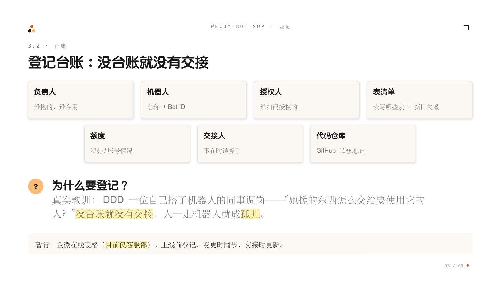

# 02 登记台账：每个机器人都要进在线表格，没台账就没有交接

**结论**：每个机器人**上线前必须登记到在线台账**。真实教训：DDD 一位自己搭了机器人的同事调岗——"她搓的东西怎么交给要使用它的人？"没有台账就没有交接，人一走机器人就成孤儿。

## 台账在哪

暂行方案：机器人的登记与维护记录，统一用**企业微信在线表格**做台账。

**[智能体资产台账（企微在线表格）](https://doc.weixin.qq.com/sheet/e3_ATQAYwb8ABcCNRzkGIa8zRp09QEV1?scode=AGwA7wemAAg4gcPPlxAesA0gZZAOs&tab=BB08J2)**

⚠️ 注意：这张表**目前只是客服部的台账，还不是企业通用的**。其他部门先参照下面"登记什么"的字段自建部门表，或等企业通用版建好后迁移（资产入口汇总见 [[02-配套资产-公司GitHub与登记台账]]）。

## 登记什么

| 字段 | 说明 |
| :--- | :--- |
| 负责人 | 谁搭的、谁在用 |
| 机器人 | 名称 + Bot ID |
| 授权人 | 谁扫码授权的 |
| 表清单 | 机器人读写哪些表（含新旧表关系） |
| 额度 | 积分/账号情况 |
| 交接人 | 负责人不在时谁接手 |
| 代码仓库 | 脚本/提示词存的公司 GitHub 仓库地址（见 [[03-登记/03-代码脚本存公司GitHub-必须私有仓库|下一篇]]） |

## 什么时候登记、什么时候更新

- **上线前**：七步流程的最后一步就是登记，不登记不上线；
- **变更时**：换表、扩权限、换负责人，台账同步改；
- **交接时**：按 [[04-维护/03-调岗离职交接-先停写再验证七天收权|交接 SOP]] 走完，台账更新后才算交接完成。
