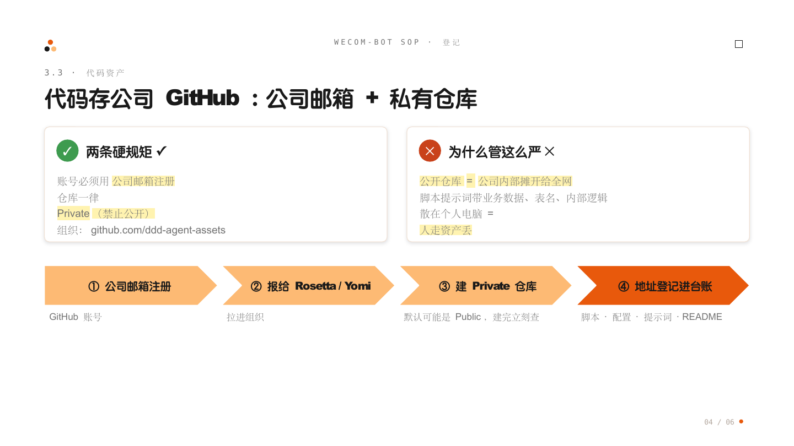

# 03 代码脚本存公司 GitHub：必须公司邮箱注册，仓库必须私有

**结论**：智能体的代码、脚本、提示词是公司资产，**统一存公司 GitHub 组织 [ddd-agent-assets](https://github.com/ddd-agent-assets)**。两条硬规矩：**GitHub 账号必须用公司邮箱注册（禁止个人邮箱）；仓库必须设为 Private（禁止公开）**。

## 为什么

- 脚本和提示词是业务资产，散落在个人电脑里=人走资产丢；
- 代码里可能带业务数据、表名、内部逻辑——**公开仓库等于把公司内部摊开给全网**，没有例外。

## 规矩明细

| 事项 | 规矩 |
| :--- | :--- |
| 组织地址 | <https://github.com/ddd-agent-assets> |
| 组织管理员 | AIC Rosetta、客服主管 Yomi |
| 账号 | **自行注册** GitHub 账号，**必须用公司邮箱**，不允许用个人邮箱 |
| 仓库可见性 | 一律 **Private**；建仓库时默认可能是 Public，建完立刻检查设置 |
| 存什么 | 自动化脚本、配置文件、提示词（prompt）、使用说明 README |
| 登记联动 | 仓库地址填进[[03-登记/02-登记台账-在线表格\|资产台账]]的"代码仓库"列 |

## 上手三步

1. 用**公司邮箱**注册 GitHub 账号；
2. 把账号名报给 Rosetta 或 Yomi，拉进 ddd-agent-assets 组织；
3. 在组织下建 **Private** 仓库，把脚本和说明传上去，仓库地址登记到台账。

