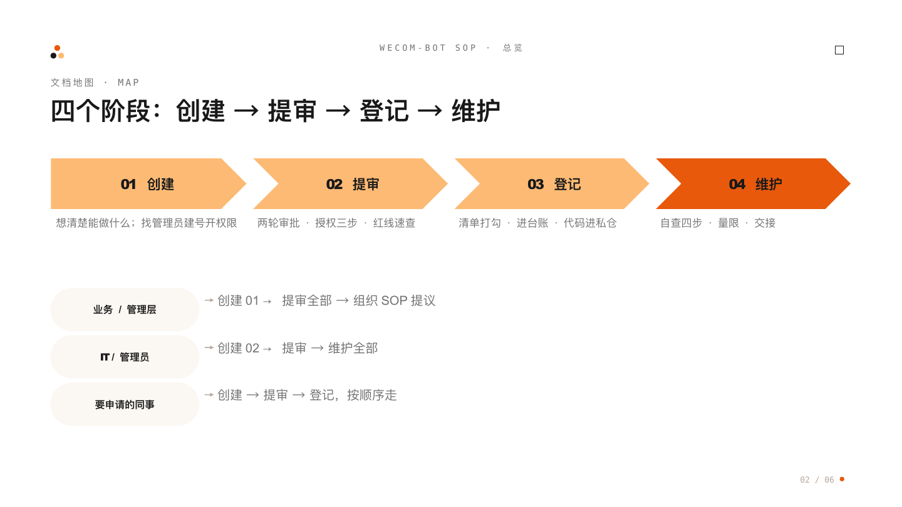

# 企微智能机器人 SOP：创建 → 提审 → 登记 → 维护

用 Workbuddy 等工具在企业微信发布智能机器人的全流程知识库。**这套文档是给全公司看的，不是给 IT 看的**——客服、业务、行政、管理层，包括完全没有技术背景的同事，都能照着走。

## 背景三句话

1. 2026-08-18 企微全面开放后，业务同事**自己就能搭智能机器人**，不再是 IT 的专利；
2. 但机器人操作企微文档有硬性边界（**读要本人授权，写只能写机器人自己建的表**），很多人卡在"申请了权限还是用不了"；
3. 这套文档把两件事分开讲：**腾讯定的规矩**（只能照办，审批也改不了）和**我们自己定的规矩**（内部协商、管理层拍板）。

## 这套文档的逻辑：创建 → 提审 → 登记 → 维护

| 阶段 | 你要干什么 | 看哪篇 |
| :--- | :--- | :--- |
| **01 创建** | 想清楚机器人能做什么、找管理员建号 | [机器人能做什么](01-创建/01-机器人能做什么-读要授权写只能写自己建的表.md)、[创建机器人：只有管理员能建](01-创建/02-创建机器人-管理员建号开权限.md) |
| **02 提审** | 发布审批、授权、搞清哪些批了也没用 | [发布两轮审批](02-提审/01-发布先过两轮审批-上级加管理员.md)、[授权三步](02-提审/02-授权三步-建号扫码发链接.md)、[红线速查](02-提审/03-红线速查-批了也没用别往审批里塞.md)、[必须走的流程](02-提审/04-必须走的流程-企微强制没有商量.md) |
| **03 登记** | 上线前打勾、登记台账、代码存公司 GitHub | [上线检查清单](03-登记/01-上线检查清单-打勾才可上线.md)、[登记台账](03-登记/02-登记台账-在线表格.md)、[代码存公司GitHub](03-登记/03-代码脚本存公司GitHub-必须私有仓库.md) |
| **04 维护** | 报错自查、量限、交接 | [报"无权限"先自查](04-维护/01-报无权限先自查-排查四步.md)、[日常量限](04-维护/02-日常量限-读表日上限超大表拆分.md)、[调岗离职交接](04-维护/03-调岗离职交接-先停写再验证七天收权.md) |
| 组织级提议 | 数据分级、七步流程、bot管理员（**提议，非现行制度**） | [01-提议-组织SOP](01-提议-组织SOP.md) |
| 配套资产入口 | 公司 GitHub、登记台账（内部链接汇总） | [02-配套资产-公司GitHub与登记台账](02-配套资产-公司GitHub与登记台账.md) |
| 想核实出处 | 官方文档、内部实测记录索引 | [03-附录-证据与信源](03-附录-证据与信源.md) |

## 三句话总结

1. 智能机器人已经能操作企微里的消息、邮件、文档、表格、日程、会议；
2. 但文档有边界：**读要本人授权，写只能写机器人自己新建的**——员工建的旧表，机器人永远改不了，这不是权限没配好；
3. 授权和审批都是**第一次走流程**，之后日常使用不用每次审批。

## 阅读路径

- 业务 / 管理层：创建 01 → 提审全部 → [组织SOP提议](01-提议-组织SOP.md)
- IT / 管理员：创建 02 → 提审全部 → 维护全部
- 要申请机器人的同事：创建 → 提审 → 登记，按顺序走
- 想核实出处的：[附录](03-附录-证据与信源.md)

## 附赠 Skill：让 AI 带你走提审流程

[`wecom-bot-approval/`](wecom-bot-approval/SKILL.md) 是可分发的 AI skill（SKILL.md 标准格式），给 Codex / Workbuddy 安装后，AI 会：

- 指导任何部门任何人走通提审全流程（卡在哪步讲哪步）；
- 帮你写好**"提审一句话"**——审批界面只显示 2 行，必须短平快，一句话带清"干什么、哪张表（新/旧）、读还是写"；
- 答疑解惑（红线、无权限自查、交接）；提醒登记台账、用公司账号上传公司 GitHub **私有**仓库、联系管理员审批（管理员等组织信息**可配置**，跨组织分发只改配置表）。

安装方式：把本仓库链接发给 AI，让它安装 `wecom-bot-approval` 这个 skill 即可。

## 写作与编号规矩（贡献者看）

- **标题即结论**：每篇、每节的小标题直接写结论，扫一眼抓到重点；
- 不讲技术原理，只讲"能做什么、不能做什么、要找谁、点哪里"；技术细节单独标注给 IT；
- **编号**：文件夹一套序号（`01-创建`→`04-维护`，夹内文档再从 01 起），根目录散文档一套序号（`01-提议`→`03-附录`），`README.md` 与 `wecom-bot-approval/` 不编号。

## 经验源头与维护

- 一线实测经验持续记录在上级目录《已知的坑》（`../已知的坑.md`），新发现先记在那里，再并入本库；
- 平台规矩以企微官方文档当日版本为准；大版本更新后，优先复核提审篇"红线速查"和"必须走的流程"；
- 旧草稿已清理（2026-08-26），本库只保留现行版本。
